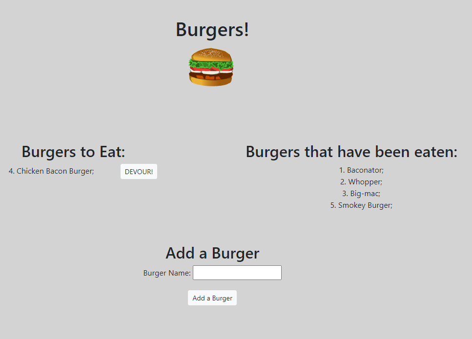

## Eat Da Burger

A burger logger built with MySQL, Node, Express, Handlebars and a homemade ORM. Follows the MVC design pattern; Node and MySQL used to query and route data in the app, and Handlebars to generate your HTML.

## Motivation

Build an application that uses MVC folder design structure as well as a MySQL Database, to track burgers that are to be eaten and those that have been eaten. App hosted on heroku

## Website

The hosted app on Heroku can be found here: https://stark-tundra-94857.herokuapp.com/

## Getting Started

1. Navigate to the landing page shown above
2. Add burgers to be devoured using the form at the bottom
3. Devour burgers by using the button rendered using handlebars beside their name
4. See which burgers have been eaten on the right hand side

## Prerequisites

No special hardware or software is required to use this web app. All you need is a modern browser.

## Screenshots

## Built With

HTML
CSS (including Foundation CSS framework)
JavaScript
console.table
express
MySQL
CSS
Handlebars
body-parser

## Author(s)

Wilson Birch (wilsonbirch)

## License

MIT: 

## Acknowlegments

App Idea created by Carleton University Coding Bootcamp, Trilogy education services.
